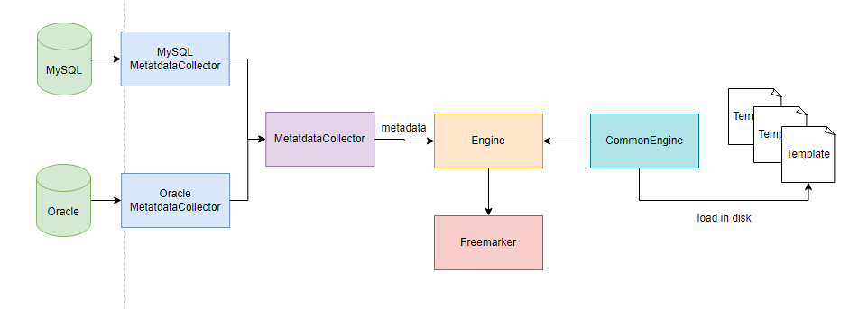

## Code Gen 通用代码生成器

###  Instruction
代码生成是提高生产效率的有效手段，避免开发者重复造轮子，作者对[自己以前的项目](https://gitee.com/Rhythm-2019/code-gegerator)进行重构，试图打造一款可拓展、表驱动、易用的通用代码生成器。

代码生成的原理可以简单理解为字符串替换，将模板内容 ```“Hello ${userName}” ```以及 ```data {"userName": "world"} ```传入模板引擎，即可获得``` "Hello world"``` 字   符串。

利用模板引擎，我们可以通过预先编写好的模板附加用户数据生成邮件内容、配置文件、代码、HTML等。

模板引擎一般配套自己的占位语法、函数等，例如 Golang 中 template，利用他可以生成一些配置文件和代码 

```go
package main

import (
	"os"
	"text/template"
)

type Todo struct {
	Name        string
	Description string
}

func main() {
	td := Todo{"Test templates", "Let's test a template to see the magic."}

  t, err := template.New("todos").Parse("You have a task named \"{{ .Name}}\" with description: \"{{ .Description}}\"")
	if err != nil {
		panic(err)
	}
	err = t.Execute(os.Stdout, td)
	if err != nil {
		panic(err)
	}
}
```

Python 中的 Jinja 常常被用于自动化部署中间件时的配置文件生成，

```go
[mysqld]
{{ bin_log_open}}
```

Java 中著名的模板引擎 

* [Thymeleaf](https://www.thymeleaf.org/doc/tutorials/3.0/usingthymeleaf.html)

  使用标签作为语法，对 HTML 渲染有着很好的支持，Spring Boot 推荐，文档详细。

* [Freemarker](https://freemarker.apache.org/)

  Java 编写的模板引擎，可以处理各种文本文件，使用 ```${}``` 表达模板内容，文档详细

  

综上，我选择  Freemarker 更适合代码生成的模板引擎，下图是代码中几个核心类的依赖关系



## Quick Start
#### 基于已有的模板生成代码
拉取本项目，修改 generator.properties 中的配置
```properties
# 数据库设置
generator.database.ip=192.168.80.154  # IP地址
generator.database.port=3306  # 端口
generator.database.datasourceType=mysql  # 数据库类型
generator.database.databaseName=code_generator  # 数据库名称
generator.database.username=root  # 用户名
generator.database.password=admin.001  # 密码

# 信息设置
generator.settings.projectName=example  # 项目名称
generator.settings.projectComment=测试用例  # 备注
generator.settings.author=Rhythm-2019  # 作者
generator.settings.company=mdnote  # 公司/组织
generator.settings.version=1.0  # 版本
generator.settings.email=rhythm_2019@163.com  # 邮箱
generator.settings.outputPath=C://Users//Rhythm//Desktop//test//   # 输出位置
generator.settings.expectProjectType=springboot  # 期望生成的代码类型，需要和 resources/templates 中的目录名称对应
generator.settings.engine=com.mdnote.rym.engine.CommonEngine  # 引擎
```

修改完毕后，使用 Maven 打包运行即可，需要特别注意 ```generator.settings.expectProjectTyp``` 需要和模板目录名称对应。


####  拓展自己的模板

1. 在 resources/templates 下创建目录

2. 在创建目录下新建 ```config.json``` 配置文件，参考下面配置文件

   ```json
   {
     "vars": {
       "hello": "hello world"
     },
     "globalTemplates": [{
       "name": "Index.flt",
       "output": "${outputPath}/src/main/resources/static/index.html"
     }],
     "tableTemplates": [{
       "name": "Service.flt",
       "output": "${outputPath}/src/main/java/com/${company}/${projectName}/service/${r"${table.name}"}Service.java"
     }]
   
   ```

   * vars： 会被加入模板渲染时的 data 中，可以在模板中直接使用
   * globalTemplates：全局模板，即与表没有关系的代码模板。比如启动类、配置等
   * globalTemplates：表相关模板，与表中数据相关的代码模板，如实体类、前端 page 等
   globalTemplates 和 globalTemplates 是数组类型，内部对象也有两个属性：
   * name：模板文件名称
   * output：代码生成位置

   在 ```CommonEngine ```中，```config.json``` 也会被当作模板渲染，所以我们可以在配置文件中使用 data

1. 编写模板文件，例如

   ```
   <p> 测试：${hello} </p>
   ```

   更多函数用法参考 freemarker 文档

2. generator.properties 中指定该模板目录，运行即可

以上逻辑由类 ```CommonEngine ``` 实现，我们可以可以实现 ```IEngine ``` 接口来实现从网络中获取模板。


## 更新日志

目前支持的数据源：

* MySQL
* Postgres （开发中）
* Oracle （待开发）
* ...

目前支持的模板

* Spring Boot（简单整合 MyBatis、Druid）
* Go-Gin （开发中）
* 前端代码（调研中）
* ...


TODO List：

* 是否可以从网络中获取模板
* 是否可以使用多线程加速代码生成
* Engine 代码还是不太符合设计原则，是否可以再优化一下
* 补充单元测试